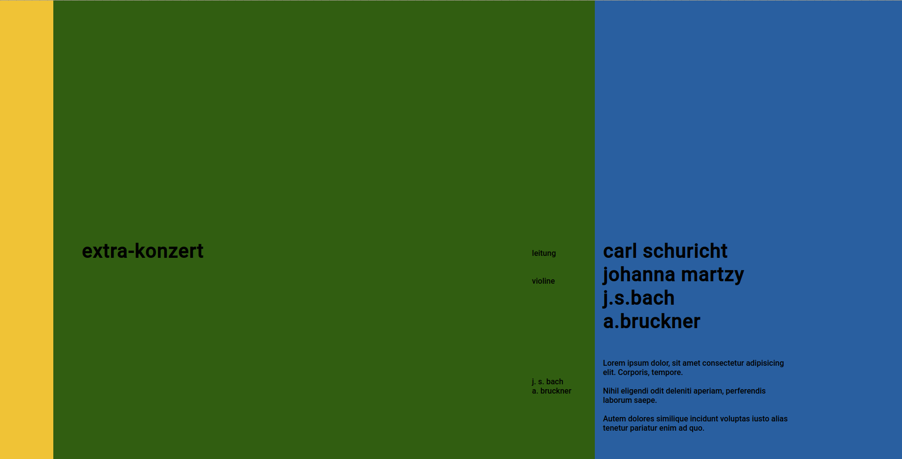

# tpximpact-takehomechallenge

1. Part one is a simple exercise where you will replicate a poster using HTML and CSS.
Please pick one poster and reproduce it using just HTML and CSS (no images), it does not need to be responsive, but it should look correct in modern browsers such as Chrome, Firefox, Safari and Microsoft Edge.
screenshot of my poster:

2. Part two is a coding exercise for which you should complete one of two options. Which one you pick is entirely up to you.
